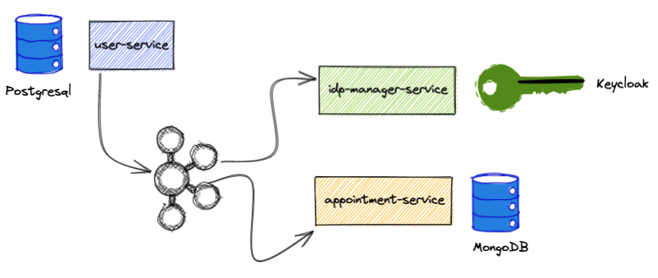

# Cloudmobility Challenge - Medical Appointment

Medical appointment system for a private hospital. The users of this system are the doctors and the patients.

## Architecture Overview



## Requirements

- As a patient, I must be able to see the availability of the doctors and schedule an appointment for myself.

- As a doctor, I must be able to see the appointments that I have for a given time period.

- As a doctor, I can set my self as unavailable for a specific time period. blocking any patients from scheduling an
  appointment for that period.

## Setting up the Environment

To run this project you will need.

- Docker installed.
- Hostname - **keycloak** created.

### Why we need to setup Hostname

**Problem**

In order to connect the backend services to the keycloak service running on a docker environment, it's necessary to set
the
**issuer-uri** property pointing to the keycloak instance. Since the keycloak's host is the container name, **keycloak**
, when calling the API to get the access token the endpoint has to be called with the hostname defined on keycloak realm
otherwise when the application receives the token the host validation will fail.

#### How to setup the hostname

macOS and Linux

```bash
sudo vi /etc/hosts

add

127.0.0.1       keycloak

```

Windows 10 and Windows 8

```bash
Press the Windows key.

Type Notepad in the search field.

In the search results, right-click Notepad and select Run as administrator.

From Notepad, open the following file:

c:\Windows\System32\Drivers\etc\hosts

add 

127.0.0.1       keycloak

Select File > Save to save your changes.
```

# Keycloak

To log into the application, you’ll need to have Keycloak up and running.

If you want to use Keycloak with Docker Compose configure correctly your **/etc/hosts for Keycloak**. (The problem that
was metioned above)

The security settings in src/main/resources/config/application.yml are configured for this image.

```yaml
spring:
  ...
  security:
    oauth2:
      client:
        provider:
          oidc:
            issuer-uri: http://localhost:9080/auth/realms/medical-appointment
        registration:
          oidc:
            client-id: internal
            client-secret: internal
```

Keycloak uses an embedded H2 database by default, so you will lose the created users if you restart your Docker
container.

- The realm medical-appointment is created once the Keycloak starts.

- The realm medical contains the client-id internal that is used to represent the appointment-service.
- This client has **directAccess** to fetch the access token.

### Get an access Token

```bash
curl -X POST internal:internal@keycloak:9080/auth/realms/medical-appointment/protocol/openid-connect/token -d "username=<email>&password=password&grant_type=password"
```

Doctor

```bash
curl -X POST internal:internal@keycloak:9080/auth/realms/medical-appointment/protocol/openid-connect/token -d "username=john-doctor@gmail.com&password=password&grant_type=password"
```

Patient

```bash
curl -X POST internal:internal@keycloak:9080/auth/realms/medical-appointment/protocol/openid-connect/token -d "username=john-patient@gmail.com&password=password&grant_type=password"
```

Example output

```json
{
  "access_token": "eyJhbGciOiJSUzI1NiIsInR5cCIgOiAiSldUIiwia2lkIiA6ICJMNnVuNFpzQ1JIV3BmQWg0bnRZZ2tuRl9QYWVLU2M5VmZIUWJyOS01LUtzIn0.eyJleHAiOjE2MzExOTEyNTMsImlhdCI6MTYzMTE5MDk1MywianRpIjoiYzIwMDcwMTgtOTQxOS00MzZkLTk1MmItNTk5YjgzMDg2NGYxIiwiaXNzIjoiaHR0cDovL2tleWNsb2FrOjkwODAvYXV0aC9yZWFsbXMvbWVkaWNhbC1hcHBvaW50bWVudCIsImF1ZCI6ImFjY291bnQiLCJzdWIiOiIwNWNiNGUzYi1hNzcxLTQyMDItYWUzOS0xMGFhZjRlNTExN2MiLCJ0eXAiOiJCZWFyZXIiLCJhenAiOiJpbnRlcm5hbCIsInNlc3Npb25fc3RhdGUiOiIxMzM4ODgxMC01NWRmLTQ5MDctYWYxOS1kNzE4ZDYwZjljZTUiLCJhY3IiOiIxIiwicmVhbG1fYWNjZXNzIjp7InJvbGVzIjpbImRlZmF1bHQtcm9sZXMtbWVkaWNhbC1hcHBvaW50bWVudCIsIm9mZmxpbmVfYWNjZXNzIiwiUk9MRV9ET0NUT1IiLCJ1bWFfYXV0aG9yaXphdGlvbiJdfSwicmVzb3VyY2VfYWNjZXNzIjp7ImFjY291bnQiOnsicm9sZXMiOlsibWFuYWdlLWFjY291bnQiLCJtYW5hZ2UtYWNjb3VudC1saW5rcyIsInZpZXctcHJvZmlsZSJdfX0sInNjb3BlIjoiZW1haWwgcHJvZmlsZSIsInNpZCI6IjEzMzg4ODEwLTU1ZGYtNDkwNy1hZjE5LWQ3MThkNjBmOWNlNSIsImVtYWlsX3ZlcmlmaWVkIjpmYWxzZSwibmFtZSI6ImpvaG4gZG9lIiwicHJlZmVycmVkX3VzZXJuYW1lIjoiam9obi1kb2N0b3JAZ21haWwuY29tIiwiZ2l2ZW5fbmFtZSI6ImpvaG4iLCJmYW1pbHlfbmFtZSI6ImRvZSIsInVzZXJJZCI6IjEiLCJlbWFpbCI6ImpvaG4tZG9jdG9yQGdtYWlsLmNvbSJ9.jsQ-Q2FjRgfyWu8hR8yC1GPnerXEluCyy1Mq8lIsd0Mu8bDcxLiWYTEbAQhpug3HaoZhyy4XEvFcZbev3SCsuJDOMHBWhJGFgRi6V4VtKwZNEynAFNwxfeywn8k96lTARFVxgeVuncDvw7z15GHP8F9PXYOEbPxKBwP0iGQbovXvZEPNj0adwxPxuB_-XTuveGb02nYSVIJF5EByRXK27DL25aLF7SShfkIhKMxfPGzI4xgovfkcGs_Us0yLykQ4lcvnAyvpl9hl9Pnbsc35qbTFt44i42bRUq9rZhVcvqnzAtclPQ3C0lOU3GDbIxEm43yWvFvRpvwwNaAl1xkG6g",
  "expires_in": 300,
  "refresh_expires_in": 1800,
  "refresh_token": "eyJhbGciOiJIUzI1NiIsInR5cCIgOiAiSldUIiwia2lkIiA6ICJlNmJiYzNlOC0xY2E3LTQ3YTItYmRkOC01MTdkODQ1MzE5MjkifQ.eyJleHAiOjE2MzExOTI3NTMsImlhdCI6MTYzMTE5MDk1MywianRpIjoiMWQ4YTczMzgtZWFiOS00MzZjLWEzZjgtYzVkYTQ4OWRjYWZmIiwiaXNzIjoiaHR0cDovL2tleWNsb2FrOjkwODAvYXV0aC9yZWFsbXMvbWVkaWNhbC1hcHBvaW50bWVudCIsImF1ZCI6Imh0dHA6Ly9rZXljbG9hazo5MDgwL2F1dGgvcmVhbG1zL21lZGljYWwtYXBwb2ludG1lbnQiLCJzdWIiOiIwNWNiNGUzYi1hNzcxLTQyMDItYWUzOS0xMGFhZjRlNTExN2MiLCJ0eXAiOiJSZWZyZXNoIiwiYXpwIjoiaW50ZXJuYWwiLCJzZXNzaW9uX3N0YXRlIjoiMTMzODg4MTAtNTVkZi00OTA3LWFmMTktZDcxOGQ2MGY5Y2U1Iiwic2NvcGUiOiJlbWFpbCBwcm9maWxlIiwic2lkIjoiMTMzODg4MTAtNTVkZi00OTA3LWFmMTktZDcxOGQ2MGY5Y2U1In0.5TyhIfToLwc7htlhggl8FupF6sNQrmYbmG1pJvyoIGw",
  "token_type": "Bearer",
  "not-before-policy": 0,
  "session_state": "13388810-55df-4907-af19-d718d60f9ce5",
  "scope": "email profile"
}
```

## Running Tests

To run tests, run the following command

```bash
  ./mvnw test
```

this command will run all tests from the sub-module projects.

## Build the application

To build the application, run the following command

```bash
./mvnw package 
```

- mvnw.sh is available on the root of the project.
- This command will create a executable jar and it will generate a docker image.
- The docker image will be generated by running the Jib command **dockerBuild** which is include on the maven phase
  package.
- The docker images name will be the services name of the sub-modules maven project:

````bash
appointment-service 
user-service
idp-manager-service 
````

## Running the application

To run the application, run the following command

```bash
docker-compose up 
```

### Remark

Until the keycloak service doesn't fully initialize the services that depend on will restart until they are able to
start with success.

To stop the application, run the following command

```bash
docker-compose down 
```

## Examples

### User Service

Create User / Doctor

```json
POST localhost:8081/api/users
```

Request Body

Doctor

````json
{
  "identificationNumber": "123433143111991",
  "firstName": "john",
  "lastName": "doe",
  "role": "DOCTOR",
  "email": "john-doctor@gmail.com"
}
````

User

````json
{
  "identificationNumber": "123433143111991",
  "firstName": "john",
  "lastName": "doe",
  "role": "PATIENT",
  "email": "john-patient@gmail.com"
}
````

### Appointment Service

### Doctors API

**Get my appointments**

```json
GET localhost:8083/api/doctors/appointments?startDate=2021-09-08T09: 00&endDate=2021-09-10T18: 00
```

**Create Unavailability**

```json
PATCH localhost:8083/api/doctors/unavailability
```

Request Body

````json
{
  "startDate": "2021-09-09T11:00:00",
  "endDate": "2021-09-09T12:00:00"
}
````

### Patients API

**Get doctors availability**

```json
GET localhost:8083/api/patients/doctors/availability
```

**Create Appointment**

```json
PATCH localhost:8083/api/patients/appointments/{slotId}
```

## Tech Stack

- Java 11
- Spring Framework 5
- Spring Boot 2.5.4
- MongoDB 4.2
- Kafka 6.1
- Postgresql 12.3
- Docker
- Project Reactor 3.4.9

## Documentation

The documentation for each service can be found on each service project.

## Authors

- [@pedrorlmarques](https://www.github.com/pedrorlmarques)
