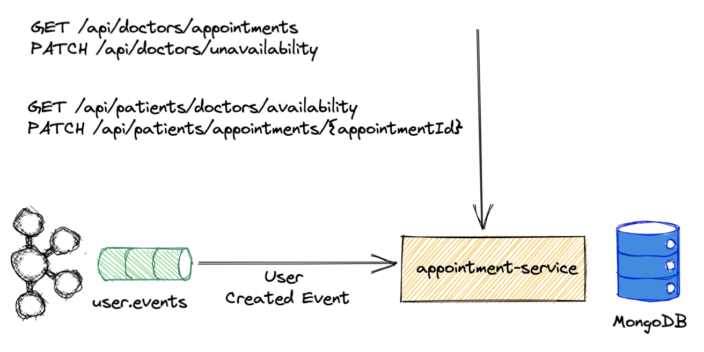
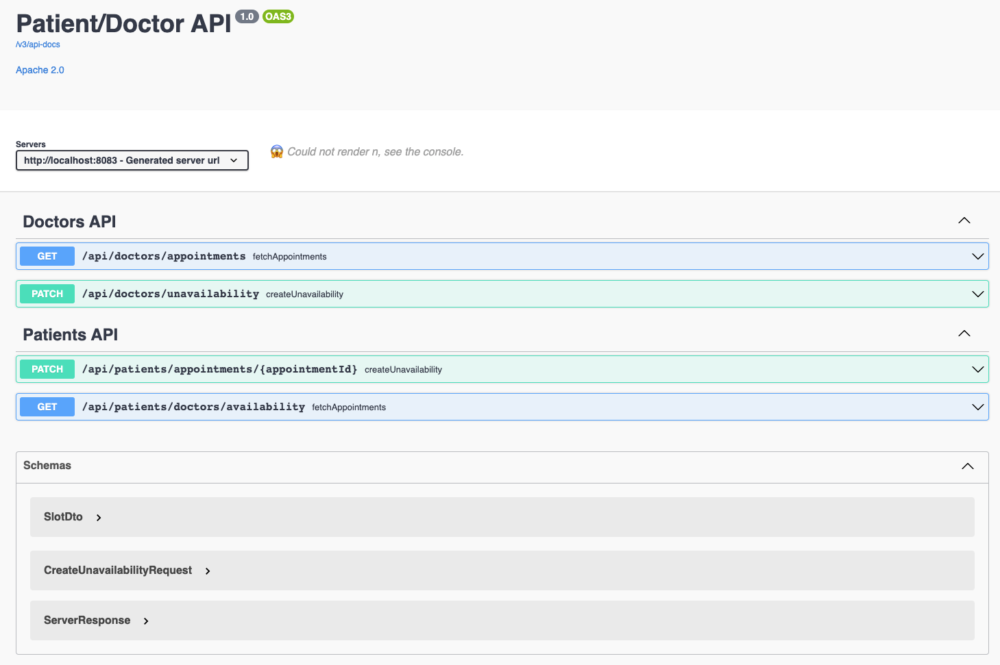

# Appointment Service

This service is responsible to create the week schedule for a doctor upon a domain user event.

This service is responsible As a patient to see the availability of the doctors and schedule an appointment for myself.

This is service responsible As a doctor, I must be able to see the appointments that I have for a given time period.

This is service responsible As a doctor, I can set my self as unavailable for a specific time period. blocking any
patients from scheduling an appointment for that period.

## Architecture Overview



### Decisions

- This service was done with reactive programming because it will be used with high usability to fetch the appointments
  and to reserve slots and high availability will be needed.
- MongoDB is used because it has a document data model that is a powerful way to store and retrieve data.
- Whenever a user domain event is received and the internal role is **PATIENT** the message is **ignored**.
- Whenever a user domain event is received and the internal role is **DOCTOR** a default week schedule is created.
- Default Week Schedule is composed of **weekdays, start slot hour, and end slot hour all of them configurable**.
- When a default week schedule is created the start time will be the time when the event is received.
- The day schedule starts from 9 am until 7 pm, each lasting about 1 hour.
- There isn't any break interval :P so the end hour of a slot is the start hour of the next one.
- There isn't any work on the weekends :D.
- If a patient has a booked slot and the doctor marks as unavailable the slot is removed for the patient.
- As stated when a doctor user event is received a default schedule is created and assigned to him.
- This approach was chosen because it automatically creates the schedule, and the hard work is done on the writing
  phase(Kafka event) instead of doing it on reading phase (rest API)
- The service is secure with security and has oauth2 has the authorization flow.

### User Event Consumer Configuration

- Configuration class that defines the consumer function.
- Consumer is a functional interface to assignment target, on our case the consumer is the UserEvent.
- When defining the property, **spring.cloud.function.definition** with the consumer, this will create an integration
  channel and that channel will be bind to a kafka topic.
- This consumer is responsible to receive user events from user.events topic and to create the default week schedule.
- Only USER_CREATED events are allowed.
- Only DOCTOR internal role are allowed.

### Domain model

```java
class Slot {
    private String id;
    private Integer doctorId;
    private Integer userId;
    private SlotStatus status;
    private LocalDateTime startTime;
    private LocalDateTime endTime;
}
```

```java
public enum SlotStatus {
    OPEN,
    BOOKED,
    UNAVAILABLE
}
```

- Slot has a startTime and endTime.
- Slot is free when the status is OPEN.
- Slot is unavailable for (doctor's reasons) when the status is UNAVAILABLE.
- Slot is assigned to a doctor when the doctorId is not null.
- Slot is assigned to a patient when the userId is not null and status is BOOKED.

### Doctors Router Configuration

- Configuration class to create rest endpoints for doctors api in a functional way.

### Patients Router Configuration

- Configuration class to create rest endpoints for patients api in a functional way.

### Concurrency writes

In order to block concurrent writes on the database @Transactional annotation is used. MongoDB only supports
transactions on the version 4 and a replica set has to be set.

### Logging

In order to have log visibility an aspect, LoggingAspect.class, was created.

### Exceptions

This service uses a library called [problem-spring-web](https://github.com/zalando/problem-spring-web), which is a set
of libraries that makes it easy to produce application/problem+json responses from a Spring application. It fills a
niche, in that it connects the Problem library and either Spring Web MVC's exception handling or Spring WebFlux's
exception handling.

A controller advice was created (ExceptionAdvice), to translate exceptions into error responses that follows RFC7807 -
Problem Details for HTTP APIs

* (https://tools.ietf.org/html/rfc7807).

Since we are using functional endpoints to define the rest apis this will not be applied because of this issue
https://github.com/zalando/problem-spring-web/issues/438

Nevertheless, there is an integration test that proves that is working for non-functional endpoints.

### Configurable Properties

```xml
appointment:
        weekdays: 5
        startSlotHour: 9
        endSlotHour: 19
```

## API Reference



### Remark

- In order to call the Doctors API the logged-in user needs to have the **ROLE_DOCTOR**.
- In order to call the Patients API the logged-in user needs to have the **ROLE_USER**.

Available Endpoint : http://localhost:8083/swagger-ui.html

This service has a swagger endpoint where we can see:

- Available endpoints and operations on each endpoint (GET, POST etc...).
- Operation parameters Input and output for each operation.
- Authentication methods.

### Metrics

Currently, the only metrics exposed are the default of spring actuator. They can be viewed
via http://localhost:8083/actuator/metrics

## Setting up the Environment

To run this project you will need.

Docker installed.

## Running Tests

To run tests, run the following command

```bash
 ./mvnw test
```

## Build the application

To build the application, run the following command

```bash
./mvnw package 
```

- mvnw.sh is available on the root of the project.
- This command will create a executable jar and it will generate a docker image.
- The docker image will be generated by running the Jib command **dockerBuild** which is include on the maven phase
  package.
- The docker image name will be **appointment-service**

## Tech Stack

- Java 11
- Spring Framework 5
- Spring Boot 2.5.4
- Kafka 6.1
- Project Reactor 3.4.9
- MongoDB 4.2
- Testcontainers
