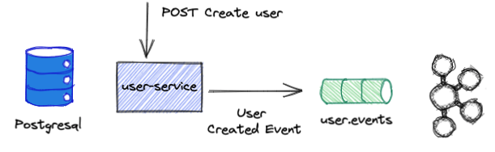
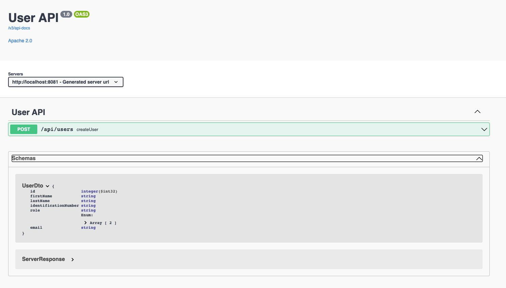

# User Service

This service is responsible to create the create users. This service is responsible to store all the users information.

## Architecture Overview



### Decisions

- This service was done with reactive programming because it will be used with high usability to fetch users information
  and especially to create new user systems.
- In case relationships are needed a postgresql is available.
- The users of this system are the doctors and the patients and it is represented by a Role (InternalRole.class)
- The email is unique per user.
- Whenever a user is created a domain event is sent to a kafka topic.

### User Event Sink Configuration

- Configuration class that defines the supplier function.
- Supplier is a functional interface to assignment target, on our case the supplier is the Sinks.Many<UserEvent>.
- When defining the property, **spring.cloud.function.definition** with the supplier, this will create an integration
  channel and that channel will be bind to a kafka topic.

### User Router Configuration

- Configuration class to create rest endpoints in a functional way.

## Dual Writes Problem

- A dual write describes the situation when you change data in 2 systems, e.g., a database and Apache Kafka, without an
  additional layer that ensures data consistency over both services.
- To overcome this problem it was used reactive transactions.
- The database transaction itself is only finalized after the write operation is successful in addition to the message
  being sent to Kafka and an acknowledgment receipt being returned - UserCreationCallback.class

### Logging

In order to have log visibility an aspect, LoggingAspect.class, was created.

### Exceptions

This service uses a library called [problem-spring-web](https://github.com/zalando/problem-spring-web), which is a set
of libraries that makes it easy to produce application/problem+json responses from a Spring application. It fills a
niche, in that it connects the Problem library and either Spring Web MVC's exception handling or Spring WebFlux's
exception handling.

A controller advice was created (ExceptionAdvice), to translate exceptions into error responses that follows RFC7807 -
Problem Details for HTTP APIs

* (https://tools.ietf.org/html/rfc7807).

Since we are using functional endpoints to define the rest apis this will not be applied because of this issue
https://github.com/zalando/problem-spring-web/issues/438

Nevertheless, there is an integration test that proves that is working for non-functional endpoints.

## API Reference



Available Endpoint : http://localhost:8081/swagger-ui.html

This service has a swagger endpoint where we can see:

- Available endpoints and operations on each endpoint (GET, POST etc...).
- Operation parameters Input and output for each operation.
- Authentication methods.

### Metrics

Currently, the only metrics exposed are the default of spring actuator. They can be viewed
via http://localhost:8081/actuator/metrics

## Setting up the Environment

To run this project you will need.

- Docker installed.

## Running Tests

To run tests, run the following command

```bash
 ./mvnw test
```

## Build the application

To build the application, run the following command

```bash
./mvnw package 
```

- mvnw.sh is available on the root of the project.
- This command will create a executable jar and it will generate a docker image.
- The docker image will be generated by running the Jib command **dockerBuild** which is include on the maven phase
  package.
- The docker image name will be **user-service**

## Tech Stack

- Java 11
- Spring Framework 5
- Spring Boot 2.5.4
- Kafka 6.1
- Keycloak 15.0.2
- Testcontainers 
